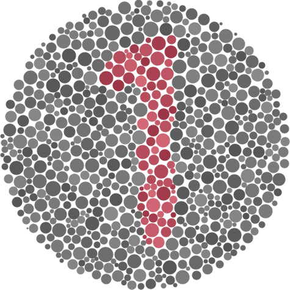
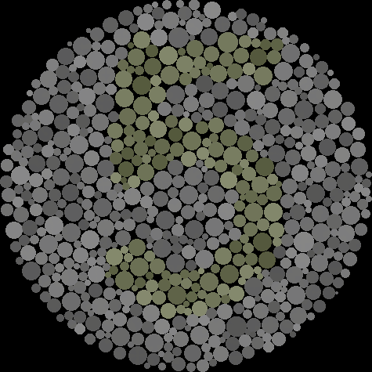
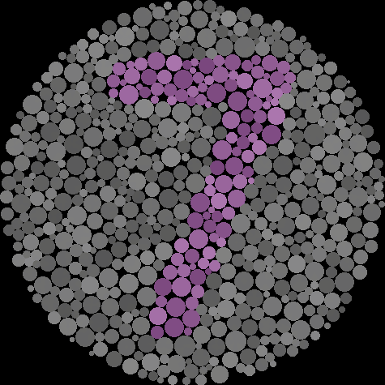

# Dataset for the comparison of the original Ishihara Disks and the Corrected Ishihara Disks for protanomaly and deuteranomaly used in our user test
- The original images were obtained from https://enchroma.com.au/pages/colour-blindness-test
- Each pair follows the format: Original ↔ Corrected.

| Original | Modificada |
|----------|------------|
|  |  |
|  |  |
|  |  |
|  |  |
|  |  |
|  |  |
|  |  |
|  |  |
|  |  |
|  |  |
|  |  |
|  |  |
|  |  |
|  |  |
|  |  |
|  |  |
|  |  |
|  |  |
|  |  |
|  |  |
|  |  |
|  |  |
|  |  |
|  |  |
|  |  |
|  |  |
|  |  |
|  |  |
|  |  |
|  |  |
|  |  |
|  |  |
|  |  |
|  |  |
|  |  |
|  |  |
|  |  |
